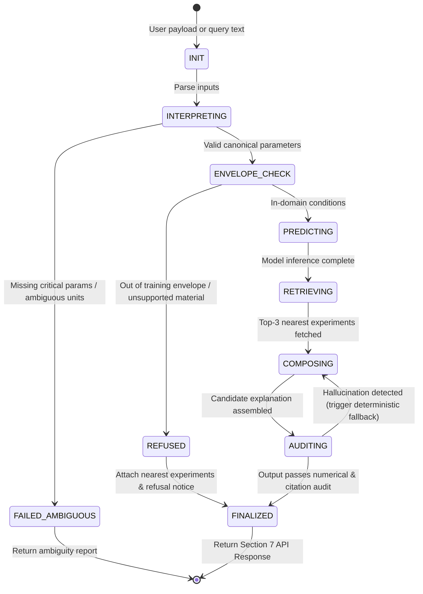

# Agent State Machine Architecture (Phase 09)

> **Document Status:** Authoritative specification for multi-agent orchestration, finite-state transitions, and reliability controls in FLARE-X.

## 1. Design Rationale

Rather than allowing unconstrained "agent chatter" or autonomous tool loops that risk non-deterministic behavior, hallucinations, and security vulnerabilities, FLARE-X orchestrates specialized single-responsibility agents through an **explicit finite-state machine (FSM)**.

Every state transition is guarded by pre-conditions and post-conditions. If an invariant is violated (e.g. out-of-domain atmospheric variables, ambiguous natural language, or numerical hallucination in text), the FSM transitions to a safe terminal state (`REFUSED`, `FAILED_AMBIGUOUS`, or falls back to a deterministic verified template).

---

## 2. State Machine Diagram

---

## 3. Specialized Agent Roles & Responsibilities

| Agent Name | Module | Responsibility | Safety Invariant |
|---|---|---|---|
| **Scenario Interpreter** | `src/agents/interpreter.py` | Extracts parameters from natural language or JSON payloads; normalizes units and material synonyms. | Cannot guess or fabricate unstated parameters; must surface ambiguity. |
| **Envelope Guard** | `src/envelope/guard.py` | Validates parameters against global bounding box, per-material limits, and kNN data density. | Strictly refuses prediction (`prediction: null`) if outside verified training space. |
| **Model Router** | `src/agents/model_router.py` | Executes Gradient Boosting model inference and formats metadata (`n_train`, `cv_accuracy`, `cv_scheme`). | Probabilities must normalize to 1.0; returns trained metadata. |
| **Evidence Retriever** | `src/agents/retriever.py` | Finds top-3 nearest empirical experiments in feature space and retrieves supporting report passages via BM25. | Cannot fabricate experiments or report IDs. |
| **Explanation Composer** | `src/agents/composer.py` | Assembles grounded scientific narrative explaining microgravity combustion physics and citing nearest flight records. | Falls back to deterministic template if text fails audit. |
| **Evidence Auditor** | `src/agents/auditor.py` | Performs regex number extraction and cross-references against prediction object; verifies cited report IDs. | Rejects any text containing unauthorized numbers or report IDs. |

---

## 4. Error Handling and Degradation Modes

1. **Unrecognized Material:**
   - Immediately transitions from `ENVELOPE_CHECK` to `REFUSED` (`status: "unsupported_category"`).
   - Returns 3 nearest materials tested in microgravity.
2. **Atmospheric Extrapolation:**
   - Transitions to `REFUSED` (`status: "extrapolation"`).
   - Retains nearest historical data points so operators understand past testing limits.
3. **LLM Hallucination:**
   - When an LLM generates candidate explanation text, `EvidenceAuditor` extracts every number. If an unrecognized number (e.g. "99.4%") or unauthorized report ID appears, the candidate text is discarded and the deterministic template is returned.
